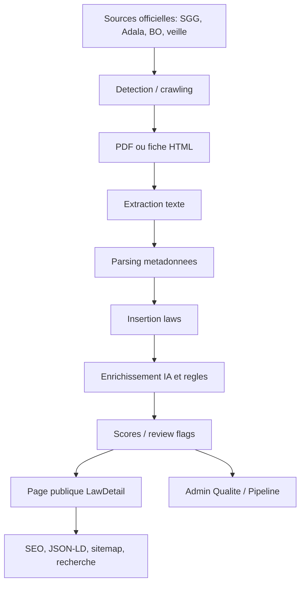

# Carte du pipeline existant

Cette carte decrit le flux observe. Les noms de fonctions sont ceux vus dans les
fichiers quand ils existent clairement.

## Vue d'ensemble

## Etapes detaillees

| Etape | Fichiers | Entrees | Sorties | Qualite actuelle | Risque |
| --- | --- | --- | --- | --- | --- |
| Decouverte SGG | `crawl_sgg.py` | pages SGG, liens PDF | liste PDF avec titre hint | bonne source officielle | source fiable, mais titre/numero parfois derives du fichier |
| Decouverte Adala | `crawl_adala.py` | `/search?page=N` | fiches HTML, PDF URL | tres large couverture | metadata_only et titres bilingues parfois incoherents |
| Veille | `veille_juridique.py`, `import_from_queue.py` | sources surveillees, BO, import_queue | items pending | architecture semi-auto | le moteur canonique n'est pas une etape explicite |
| Telechargement PDF | `crawl_sgg.py`, `import_from_queue.py`, `extract.py` | URL PDF | bytes/fichier local | robuste sur SGG/queue | echec si serveur bloque, PDF scanne, mauvais content-type |
| Extraction texte | `extract.py`, `crawl_sgg.py`, `import_from_queue.py` | PDF | `content_fr`, `content_ar` | pdfplumber, PyMuPDF, OCR dans `extract.py` | OCR pas uniformement disponible dans tous les scripts |
| Parsing titre/type/numero/date | `extract.py`, `crawl_sgg.py`, `crawl_adala.py`, `fix_imported_titles.py` | titre, URL, contenu | champs `laws` | nombreuses heuristiques | absence d'arbitrage central entre fiche et PDF |
| Insertion DB | scripts pipeline | record `laws` | ligne Supabase | deja structure | valeurs "fallback" peuvent devenir publiques |
| Enrichissement | `enrich.py` | ligne `laws` | resumes, TOC, SEO, slug, scores | riche | peut enrichir avant validation juridique |
| Scoring | `score_utils.py`, `enrich.py` | ligne `laws` | scores 0-100 | bon debut | score mesure completude plus que coherence juridique fine |
| Page publique | `LawDetail.jsx` | `canonical_slug` | page texte + PDF | UX solide | confiance publique possible sur donnees non validees |
| Admin | `Admin.jsx` | `laws`, `import_queue`, `pipeline_runs` | listes qualite/pipeline | deja pret pour extension | pas de "diff fiche vs PDF" specialise |

## Flux SGG observe

1. `discover_pdfs()` trouve les PDF sur SGG.
2. `download_pdf()` sauvegarde localement.
3. `extract_text_from_pdf()` extrait le contenu avec PyMuPDF.
4. `extract_info_from_url()` derive type et numero depuis le fichier/URL.
5. `extract_number_from_title()` et `extract_date_from_title()` completent.
6. `process_pdf()` construit `record`.
7. Insertion dans `laws` avec `source_name`, `source_url`, `canonical_slug`,
   `extraction_status`, `extraction_confidence_score`.

Point d'insertion propose : entre 3 et 6, appeler un futur moteur canonique.

## Flux Adala observe

1. `fetch_page()` lit les cartes HTML.
2. Extraction : `title_ar`, `type_ar`, `number_explicit`, `matiere_ar`,
   `source_url`.
3. `process_item()` convertit type/domaine, detecte date, fait lookup titre FR.
4. Insertion en `metadata_only`, score faible, `needs_human_review=true`.

Point d'insertion propose : avant insertion, telecharger/inspecter le PDF si
possible et comparer avec la fiche. Si impossible, garder `metadata_only` mais
mettre un drapeau canonique explicite.

## Flux import_queue observe

1. `get_queue()` charge les items pending.
2. `download_pdf()` recupere le PDF.
3. `extract_text_from_pdf()` extrait avec PyMuPDF.
4. `upload_to_storage()` sauvegarde le PDF.
5. `insert_law()` cree la ligne `laws`.
6. `score_utils.compute_scores()` et `apply_automation_rules()` decident la
   publication/review selon mode.

Point d'insertion propose : avant `insert_law()`, produire
`canonical_legal_record`; apres `insert_law()`, sauvegarder `metadata_diff`.

## Flux enrichissement observe

1. `compute_confidence_score()`
2. `detect_articles()`
3. `extract_keywords()`
4. `make_canonical_slug()`
5. `extract_toc_no_ai()` puis `generate_toc_ai()`
6. `generate_summary_ai()`
7. `generate_seo_fields()`
8. `score_utils.compute_scores()`

Point d'insertion propose : `enrich.py` doit refuser ou limiter SEO/resume si
`canonical_validation_status` n'est pas assez fort.

## Cartographie public/SEO/RAG

- `fetchLawBySlug()` resout `canonical_slug`, ID, number et `slug_history`.
- `LawDetail.jsx` choisit `pdf_url || source_url`.
- `useSEO()` recoit titre, description, canonical et noindex.
- `JsonLD` expose le document juridique.
- `build_site_search_index.py` construit l'index de recherche interne.
- `generate_sitemap.py` expose les URLs.

Regle cible : aucun contenu SEO/RAG definitif ne doit etre construit sur une
identite juridique non arbitree.

