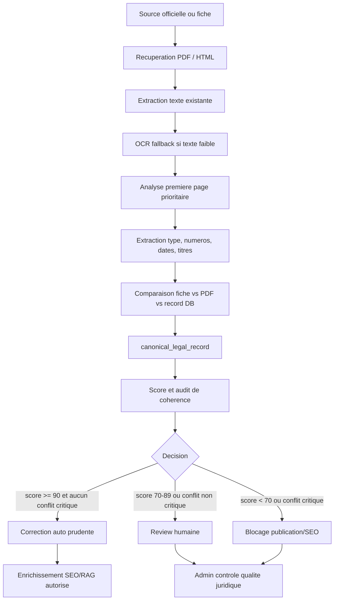

# Pipeline canonique propose

Nom propose : `LEGAL_DOCUMENT_CANONICALIZATION_ENGINE`.

But : produire une identite juridique officielle, verifiable et versionnee avant
tout enrichissement SEO, resume, slug, indexation ou usage RAG.

## Principe

Le moteur ne "corrige" pas directement la base par defaut. Il produit d'abord :

- un `canonical_legal_record` ;
- un `metadata_diff_report` ;
- un `consistency_audit_result` ;
- eventuellement un `human_review_item`.

L'ecriture automatique n'est autorisee que si les preuves sont coherentes et le
score depasse un seuil strict.

## Architecture cible



## Ordre des preuves

1. PDF officiel ou BO officiel.
2. Premiere page du PDF, car elle contient souvent le titre complet, le dahir,
   la loi promulguee, la date, et parfois le numero BO.
3. Texte complet extrait.
4. Fiche officielle HTML.
5. Nom de fichier officiel.
6. Metadonnees deja en DB.
7. Inference IA ou lookup externe.

Une inference IA ne doit jamais battre une preuve explicite du PDF officiel.

## Etapes du moteur

### 1. Source normalization

Normaliser :

- `source_name` ;
- `source_url` ;
- `pdf_url` ;
- domaine source officiel ;
- nature source : `official_pdf`, `official_html`, `storage_copy`,
  `metadata_only`, `manual`.

### 2. PDF retrieval

Si `pdf_url` existe, utiliser la copie Storage. Sinon tenter `source_url` si PDF.
Si la fiche Adala pointe vers un PDF, tenter l'analyse en dry-run.

Sortie :

```json
{
  "pdf_available": true,
  "pdf_sha256": "example",
  "page_count": 12,
  "retrieval_status": "success"
}
```

### 3. Extraction texte et OCR

Reutiliser l'existant :

- `pdfplumber` si fichier texte ;
- PyMuPDF fallback ;
- OCR si moins de caracteres que le seuil ;
- extraction des premieres pages separee du texte complet.

Seuils proposes :

- page 1 < 200 caracteres : essayer OCR page 1 ;
- document < 500 caracteres : `extraction_status=needs_review`;
- aucun texte : `metadata_only`.

### 4. First page legal parser

Parser prioritaire de la premiere page :

- titre officiel FR ;
- titre officiel AR ;
- type formel du texte ;
- numero du dahir ;
- numero de la loi promulguee ;
- date de signature/promulgation ;
- date de publication BO ;
- numero BO ;
- mentions "modifiant", "completant", "abrogeant".

Le parser doit produire des preuves avec position :

```json
{
  "field": "law_number",
  "value": "59-24",
  "evidence": {
    "source": "pdf_page_1",
    "quote": "Loi n 59-24",
    "page": 1
  }
}
```

### 5. Legal identity arbitration

Construire l'identite selon les regles :

- `instrument_type` : type formel publie (`Dahir`, `Loi`, `Decret`, etc.).
- `law_type` : type du texte promulgue si distinct.
- `official_number` : numero principal pour la fiche publique.
- `dahir_number` : numero du dahir de promulgation si present.
- `law_number` : numero de la loi promulguee si present.
- `signature_date` : date du dahir/decret.
- `law_date` : date de la loi si distincte.
- `bo_publication_date` : date de BO.
- `canonical_title_fr/ar` : titre officiel, pas le nom de fichier.

### 6. Metadata comparison

Comparer le `canonical_legal_record` au record existant :

- `title_fr`;
- `title_ar`;
- `type`;
- `number`;
- `date`;
- `bo_number`;
- `bo_date`;
- `source_url`;
- `pdf_url`;
- `canonical_slug`.

Chaque difference recoit :

- severite : `info`, `warning`, `critical`;
- action proposee : `keep`, `update_auto`, `review`;
- justification.

### 7. Decision

Regles de decision :

- Auto-update seulement si score >= 90, source officielle PDF, aucun conflit
  critique, et champ cible non modifie manuellement.
- Review si score entre 70 et 89, ou si PDF et fiche divergent, ou si type/date
  sont incertains.
- Blocage SEO si score < 70, PDF absent, titre faible, type/numero incoherent.

### 8. Enrichissement post-validation

SEO, TOC, resume, slug et JSON-LD doivent etre recalcules seulement apres :

- `canonical_validation_status in ('verified', 'high_confidence')` ; ou
- validation humaine explicite.

Les anciens slugs doivent aller dans `slug_history`.

## Sorties attendues

1. `canonical_legal_record`
2. `metadata_diff_report`
3. `consistency_audit_result`
4. `human_review_item` si necessaire
5. patch DB propose, mais non applique dans cette proposition

